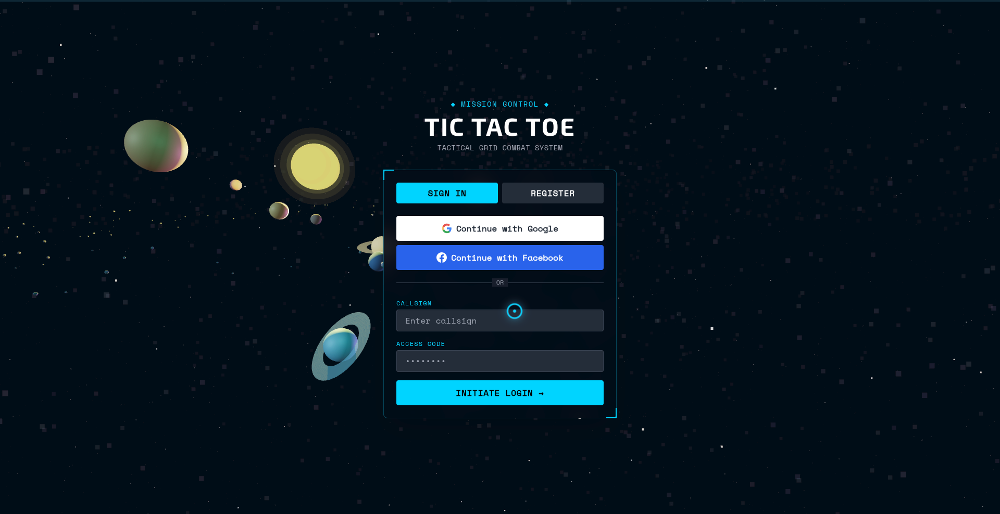
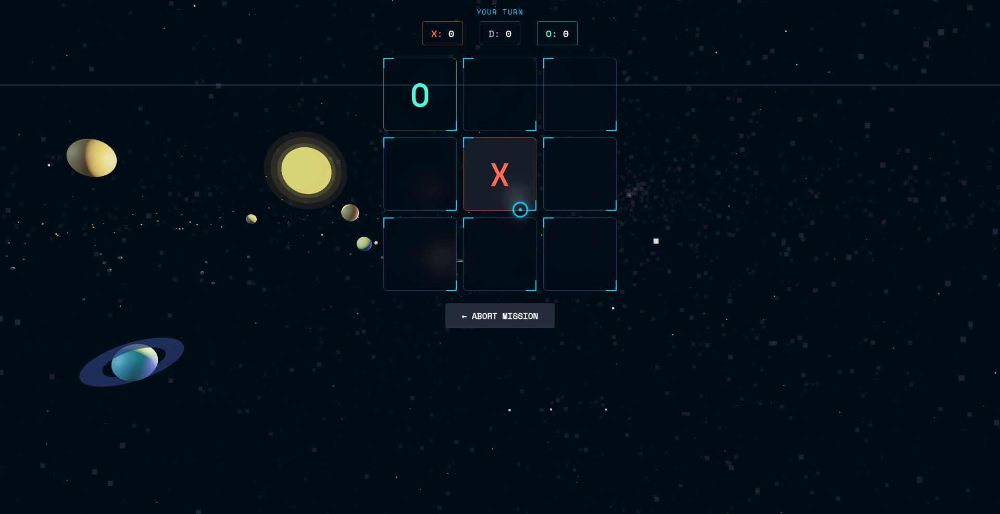
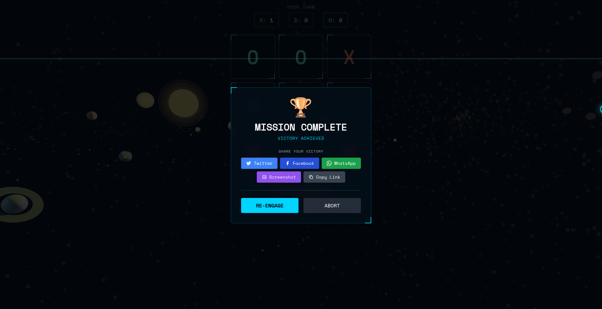
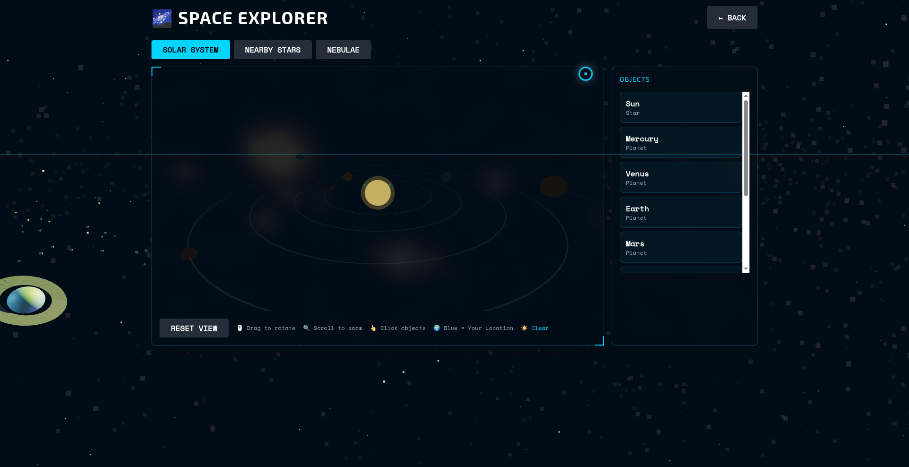

# 🎮 Tic Tac Toe - Mission Control

<div align="center">

**A stunning real-time multiplayer Tic Tac Toe game with 3D space visuals and NASA-inspired UI**

[](https://tictactoe-multiplayer-kx9u.onrender.com/)
[](https://nodejs.org/)
[](https://threejs.org/)

[🚀 Play Now](https://tictactoe-multiplayer-kx9u.onrender.com/)

</div>

---

## 📸 Screenshots

### Authentication & 3D Background

*NASA-themed login with realistic 3D planets, stars, and real-time weather effects*

### Gameplay

*Mission control interface with real-time gameplay and cinematic space background*

### Victory Screen

*Share your wins on Twitter, Facebook, WhatsApp, or download screenshot*

### 3D Space Explorer

*Fully 3D solar system with orbital controls - drag to rotate, scroll to zoom*

---

## ✨ Features

### 🚀 NASA-Inspired UI
- **Mission Control Theme** - Professional HUD interface with "Exo 2" typography
- **Cinematic Experience** - Dynamic lighting, realistic 3D planets, and glassmorphism panels
- **Corner Bracket System** - Tactical interface design inspired by spacecraft displays

### 📱 Mobile & Performance
- **Mobile-First Design** - Fully responsive layout optimized for all screen sizes
- **Touch Controls** - Enhanced tap targets and fluid typography for mobile operators
- **High Performance** - Optimized rendering achieving 60fps on desktop and smooth mobile play
- **Static Background Mode** - Smart switching to static starfields during gameplay for zero lag

### 🎮 Game Modes
- **Online Multiplayer** - Play with friends using 4-character room codes
- **AI Opponent** - Challenge an unbeatable minimax AI
- **Live Chat** - Real-time chat during multiplayer games
- **Rematch System** - Quick rematch with symbol swapping

### 🔐 Authentication & Data
- **Zero-Config Persistence** - Automatic file-based database (users.json) requires NO setup
- **Secure Auth** - Username/Password, Google OAuth, and Facebook OAuth
- **Stats Tracking** - Persistent records of wins, losses, and draws

### 🌌 3D Space Experience
- **Scientifically Accurate** - Real astronomical data for planets and stars
- **20,000+ Stars** - Temperature-based coloring (Red Dwarfs to Blue Giants)
- **Complete Solar System** - All 8 planets + Moon with correct orbital periods
- **Real-Time Weather** - Rain, snow, clouds based on your physical location
- **Interactive Cursor** - Particle trail effects and shooting stars

### 🌠 3D Space Explorer
- **Interactive Orerry** - Full 3D controls to rotate and zoom the solar system
- **Nearby Stars** - Explore the 8 closest stars to Earth (Proxima Centauri, Sirius, etc.)
- **Nebulae Gallery** - View 6 famous nebulae (Orion, Crab, etc.) with accurate details
- **Detailed Info** - Click any object for mass, temperature, distance, and type

---

## 🚀 Quick Start

### Prerequisites
- Node.js 16 or higher
- npm or yarn

### Installation

```bash
# Clone the repository
git clone https://github.com/Raul909/Tic-Tac-Toe-.git
cd Tic-Tac-Toe-/tictactoe

# Install dependencies
npm install

# Start the server
node server.js
```

Visit `http://localhost:3000` and start playing!

---

## 🌦️ Weather System

The app syncs with your real location to display weather effects:

- **Geolocation** - Requests browser location (optional)
- **Weather API** - Open-Meteo (free, no API key)
- **Visual Effects** - Rain, snow, clouds, or clear
- **Privacy** - Location not stored, works without permission

---

## 🎯 How to Play

### Multiplayer
1. **Login** with Google, Facebook, or username/password
2. **Create Room** - Click "LAUNCH ROOM" and share the code
3. **Join Room** - Click "DOCK" and enter the code
4. **Play** - Take turns, chat, and compete!

### AI Mode
1. Click "ENGAGE AI"
2. Challenge the unbeatable AI
3. Try to beat it!

### Space Explorer
1. Click 🌌 SPACE button
2. Explore Solar System, Stars, or Nebulae
3. Drag to rotate, scroll to zoom, click objects for info

---

## 🛠️ Tech Stack

**Backend**: Node.js, Express, Socket.IO, MongoDB / File-based JSON
**Frontend**: Alpine.js, Tailwind CSS, Three.js, Exo 2 Font
**Auth**: Google OAuth, Facebook OAuth, JWT
**3D**: Three.js, OrbitControls, PBR materials, Post-processing

---

## 🎯 Roadmap

- [x] Real-time multiplayer
- [x] AI opponent
- [x] 3D space background (all 8 planets + Moon)
- [x] 3D Space Explorer with orbital controls
- [x] Real-time weather sync
- [x] Cinematic lighting
- [x] Interactive cursor effects
- [x] Social sharing
- [x] Google & Facebook OAuth
- [x] Mobile-optimized Web App (PWA ready)
- [x] Zero-config deployment
- [ ] Tournament mode
- [ ] Global leaderboard
- [ ] Sound effects

---

## 📝 License

MIT License - see [LICENSE](LICENSE) file

---

## 🙏 Credits

- **3D Graphics**: Three.js
- **Fonts**: Google Fonts (Exo 2, Space Mono)
- **Weather**: Open-Meteo API
- **Astronomical Data**: NASA, ESA

---

<div align="center">

**Made with ❤️ and ☕**

[⬆ Back to Top](#-tic-tac-toe---mission-control)

</div>
