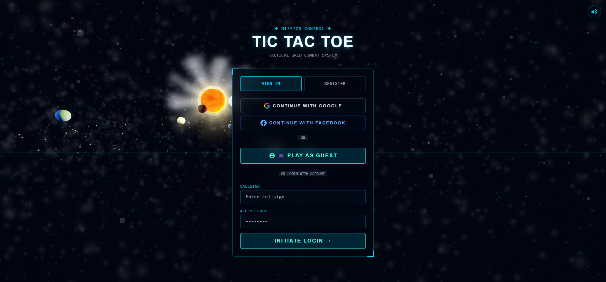
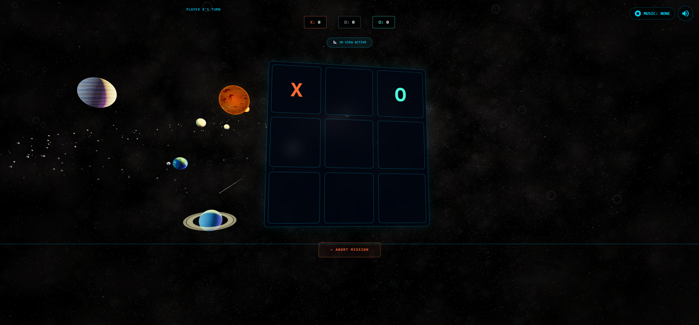
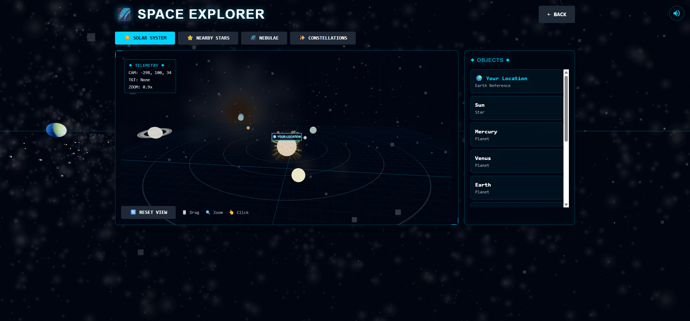
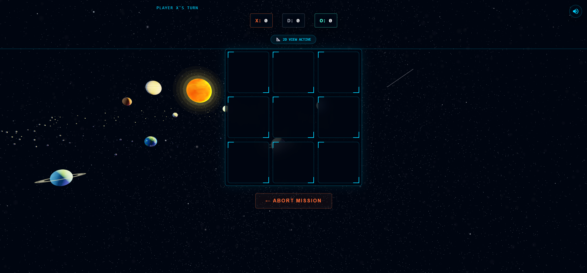

# 🎮 Tic Tac Toe - Mission Control 🌌

**A premium, real-time multiplayer Tic-Tac-Toe space experience featuring a GPU-optimized 3D celestial gallery, tournament brackets, and a robust socket-reconnection architecture.**

---

## ⚡ Deployment Status

* **Static Frontend**: Hosted on **Cloudflare Pages** for ultra-low latency global CDN delivery.
* **Persistent Backend**: Hosted on **Render** (Free Tier Web Service) for WebSocket handling, lobbies, and database synchronization.
* **Live Server**: [https://tictactoe-multiplayer-nrpb.onrender.com/](https://tictactoe-multiplayer-nrpb.onrender.com/)
* **Health Check**: [https://tictactoe-multiplayer-nrpb.onrender.com/health](https://tictactoe-multiplayer-nrpb.onrender.com/health)

---

## ✨ Features

* **🌐 Real-Time Multiplayer** — Lobby creation and join features using unique 4-character room codes.
* **🤖 Advanced AI Operator** — Challenging minimax AI opponent with customizable difficulties (`easy`, `normal`, `hard`).
* **👥 Guest Access** — One-tap CODM/PUBG-style guest login with auto-assigned callsigns.
* **🌌 Celestial Space Gallery** — GPU-accelerated WebGL solar system with cinematic camera glide controls and dynamic weather.
* **🏆 Badge Achievements** — 8 lockable operator badges with progress indicators.
* **🎵 Ambient Sound Themes** — 4 audio sound packs (SciFi, Retro, Realistic, Minimal) powered by a custom SoundManager.
* **📱 Mobile UI Optimization** — Touch-friendly tap targets (min 44x44px), viewport locking, and readable glassmorphism panels.
* **⚡ Graceful Reconnection** — 30-second disconnect grace period allowing players to rejoin active matches seamlessly.

---

## 🌌 Visual Tour

Here is a visual showcase of the premium, celestial interface you will experience in **Tic Tac Toe - Mission Control**:

| 👤 Authentication Portal | 🚀 Active Mission Control |
|:---:|:---:|
|  |  |
| *Log in as an authorized operator or tap Guest Play to launch instantly into space.* | *Interact with zero input latency upon pointer contact under a tight volumetric solar corona.* |

| 🌌 Celestial Space Explorer | 🏆 Standoff & Victory Telemetry |
|:---:|:---:|
|  |  |
| *Embark on a real-time, interactive tour of the Solar System, stars, constellations, and gaseous nebulae.* | *Achieve victory to view dynamic telemetry, score updates, and engaging space facts.* |

---

## 🛠️ Technology Stack

* **Frontend**: Alpine.js, Tailwind CSS, Three.js (WebGL 3D Space Gallery)
* **Backend**: Node.js, Express, Socket.IO, MongoDB (Mongoose)
* **Queuing & Cache**: RabbitMQ (CloudAMQP), Redis
* **Hosting**: Cloudflare Pages (Frontend), Render (Backend)

---

## 📦 Environment Variables

> [!CAUTION]
> ### 🛡️ Critical Security Warning for Public Repositories
> Since this repository is public, **NEVER** hardcode or commit actual credentials, passwords, or secrets (such as your private MongoDB Atlas connection strings or API keys) directly inside your codebase or documentation.
> - **Local Development**: Keep all credentials confined inside a local `.env` file. This file is safely listed in `.gitignore` and will never be pushed to your public GitHub repository.
> - **Production Deployment**: Inject your actual secret keys dynamically via your hosting provider's dashboard (e.g. Render Dashboard under environment variables, or Cloudflare Pages secrets).

To run the application locally or in production, configure the following variables inside your private `.env` file:

| Variable | Description | Default / Fallback |
|---|---|---|
| `MONGODB_URI` | MongoDB Atlas cluster connection string | Falls back to local `data/users.json` |
| `RABBITMQ_URL` | CloudAMQP connection URL | Falls back to in-process memory queue |
| `REDIS_URL` | Redis connection URL for cross-node sockets | Falls back to local in-memory Maps |
| `ALLOWED_ORIGINS` | Comma-separated CORS allowed domains (e.g. your Cloudflare Pages URL) | Defaults to `*` in development |
| `NODE_ENV` | Environment mode (`production` or `development`) | `development` |

---

## 🚀 Local Development

1. **Clone the Repository**:
   ```bash
   git clone https://github.com/Raul909/Tic-Tac-Toe-Space.git
   cd Tic-Tac-Toe-Space/tictactoe
   ```

2. **Install Dependencies**:
   ```bash
   npm install
   ```

3. **Start the Development Server**:
   ```bash
   npm run dev
   ```
   Open `http://localhost:3000` in your web browser.

4. **Run Verification Tests**:
   ```bash
   npm test
   ```

---

## 🌍 Production Deployments

### 1. Backend (Render)
1. Log in to the **Render Dashboard** and select **New +** → **Blueprint**.
2. Connect your GitHub repository. Render will automatically parse the `render.yaml` blueprint.
3. In the environment variables configuration on your dashboard, set:
   * `NODE_ENV` = `production`
   * `ALLOWED_ORIGINS` = `https://your-app.pages.dev` (your Cloudflare Pages URL)
   * `MONGODB_URI` = *Your MongoDB Atlas Connection String*
   * `RABBITMQ_URL` = *Your CloudAMQP Connection URL*

### 2. Frontend (Cloudflare Pages)
1. Log in to the **Cloudflare Dashboard** → **Workers & Pages** → **Connect to Git**.
2. Select your repository.
3. Configure the Build settings:
   * **Framework Preset**: `None`
   * **Build Command**: (Leave blank)
   * **Build Output Directory**: `tictactoe/public`
4. Deploy. Cloudflare will automatically build and publish your static assets globally.
